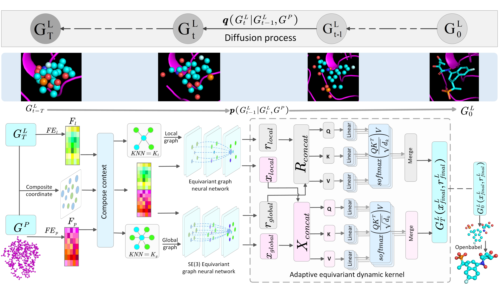

# KGMG

KGMG: a structure-aware diffusion model for Molecule Generation based on K-Nearest Neighbor and Graph Neural Network

## Model Architecture Diagram

<div align="center">  

</div>

## Requirements

[python](https://numpy.org/)==3.8.19

[numpy](https://numpy.org/)==1.23.0

[pandas](https://pandas.pydata.org/)==2.0.3

[rdkit](https://www.rdkit.org/)==2022.09.5

[torch](https://pytorch.org/)==2.0.1

[cuda](https://developer.nvidia.com/cuda-toolkit)==11.7

[torch_geometric]([PyG Documentation — pytorch_geometric documentation (pytorch-geometric.readthedocs.io)](https://pytorch-geometric.readthedocs.io/en/latest/index.html))==2.5.2

"All the detailed configurations are shown in the environment.yml file, which includes the dependencies and their versions for the environment."

## Training

### 1. Data

```bash
Due to the large size of the original  data, they cannot be uploaded to the GitHub repository. We have uploaded them to Baidu Cloud, and the link is [Baidu Cloud](https://pan.baidu.com/s/1pRLzNBG0mtszmcan5jnsZQ) with the extraction code: v9eb.
```

### 2. Train from scratch 

```bash
python train.py
```
The trained model, kgmg.pt, is saved in the checkpoint folder.

## Sampling

### 1. Sample the pockets in the test set.

```bash
python sample_diffusion.py configs/sampling.yml --data_id {i} # Replace {i} with the data index, where i should be between 0 and 99.
```

### 2. Sample from the pocket file

```bash
python sample_for_pocket.py configs/sampling.yml --pdb_path examples/2z3h_A_rec_1wn6_bst_lig_tt_docked_3_pocket10.pdb
```

## Evaluate

### Evaluate the sampling results

```bash
python evaluate_sample.py /outputs --docking_mode vina_score --protein_root data/crossdocked_pocket10
```
